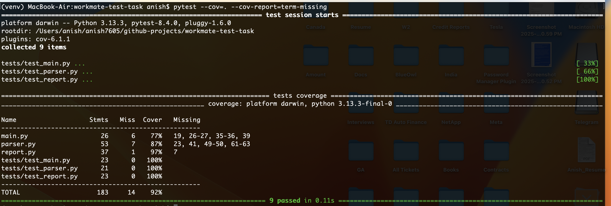

# Payroll Report Generator

This script processes employee data from CSV files and generates a payroll report in JSON format.

## Setup
1. Install Python 3.8+.
2. Install dependencies for testing:
   ```bash
   python3 -m venv venv
   source venv/bin/activate
   pip install -r requirements.txt
    ```

3. Place input CSV files in the sample_data/ directory or specify paths.

- Run the script with:

    ```bash
    python3 main.py sample_data/data1.csv sample_data/data2.csv sample_data/data3.csv --report payout
    ```

    For JSON output:

    ```bash
    python3 main.py sample_data/data1.csv --report payout --format json
    ```

    <pre>
    [
        {
            "id": 1,
            "name": "Alice Johnson",
            "department": "Marketing",
            "hours_worked": 160.0,
            "hourly_rate": 50.0,
            "payout": 8000.0
        },
        {
            "id": 2,
            "name": "Bob Smith",
            "department": "Design",
            "hours_worked": 150.0,
            "hourly_rate": 40.0,
            "payout": 6000.0
        }
    ]
    </pre>


4. Adding New Reports

- To add a new report type:
    - Create a new class in report.py inheriting from Report.
    - Implement the generate method.
    - Update ReportFactory.create_report to support the new report type.

    Running Tests

    ```bash
    pytest --cov=. --cov-report=term-missing
    ```

5. Screenshots

    Here are some screenshots of the application in action:

    ### Generated Payroll Report
    

    ### Test Coverage Report
    

